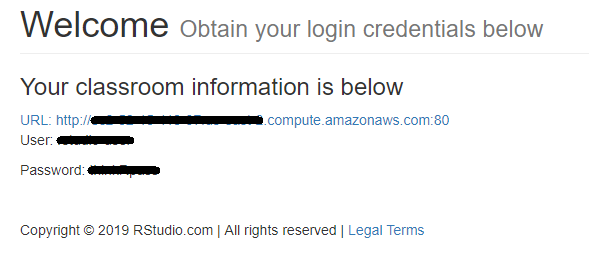
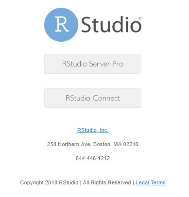

<!-- README.md is generated from README.Rmd. Please edit that file -->

```{r, include = FALSE}
knitr::opts_chunk$set(
  collapse = TRUE,
  comment = "#>",
  echo=FALSE
)
```
# classroom-getting-started

<!-- badges: start -->
<!-- badges: end -->

Follow these instructions for using your RStudio workshop classroom.

You will need a *Workshop Identifier* in the first step, and your instructor will provide this prior to starting the class.


## Step 1: Navigate to the classroom site

* Go to the classroom app: https://rstd.io/class 
* Enter your *Workshop Identifier*
* Click Submit


## Step 2: Register

Register

* Register with your name and email address

You will get a home screen with a URL, user name and password

* Point your browser browser to the URL




## Step 3: Make a note of your login details

Make a note of your:

* User name
* Password


## Step 4: Open the getting started screen

Your getting started screen contains links to RStudio Server Pro as well as RStudio Connect:




## Step 5: Open RStudio Server Pro

From the getting started screen (step 4), click the "RStudio Server Pro" button.

You will be prompted for a user name and password.  Use the information you collected in Step 3.


## Step 6: Open RStudio Connect

From the getting started screen (step 4), click the "RStudio Connect" button.


In the top, right hand corner you can find the "log in" button.  Click this.

You will be prompted for a user name and password.  Use the information you collected in Step 3.


Complete the log in process.


