<!-- README.md is generated from README.Rmd. Please edit that file -->

# classroom-getting-started

<!-- badges: start -->

<!-- badges: end -->

Follow these instructions for using your RStudio workshop classroom.

You will need a *Workshop Identifier* in the first step, and your
instructor will provide this prior to starting the class.

## Step 1: Navigate to the classroom site

  - Go to the classroom app: <https://rstd.io/class>
  - Enter your *Workshop Identifier*
  - Click Submit

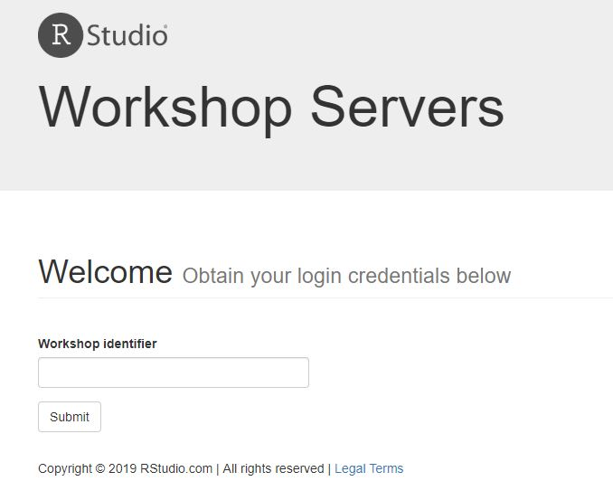

## Step 2: Register

Register

  - Register with your name and email address

You will get a home screen with a URL, user name and password

  - Point your browser browser to the URL

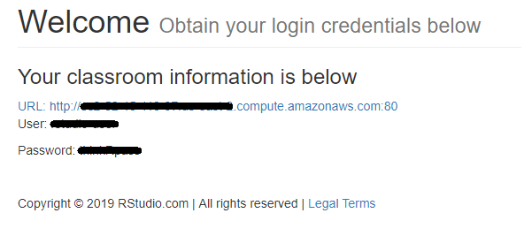

## Step 3: Make a note of your login details

Make a note of your:

  - User name
  - Password

Also, make a note of the RStudio Connect URL link, because you’ll need
to in step 7. To get the link, right click on the “RStudio Connect”
button and copy the URL.

This link will look something like this:

<http://ec2-99-99-999-99.us-east-2.compute.amazonaws.com/rsconnect/>

## Step 4: Open the getting started screen

Your getting started screen contains links to RStudio Server Pro as well
as RStudio Connect:

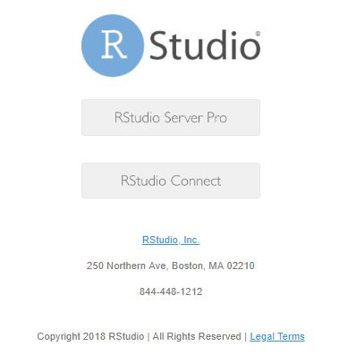

## Step 5: Open RStudio Server Pro

From the getting started screen (step 4), click the “RStudio Server Pro”
button.

You will be prompted for a user name and password. Use the information
you collected in Step 3.

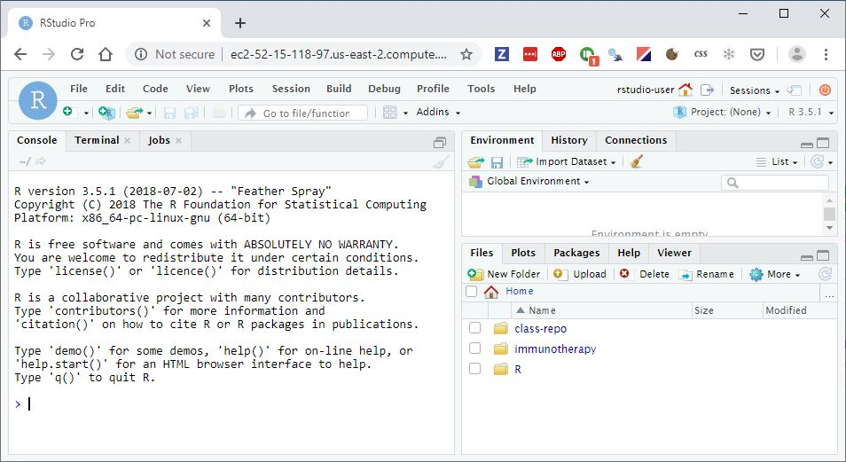

## Step 6: Open RStudio Connect

From the getting started screen (step 4), click the “RStudio Connect”
button.

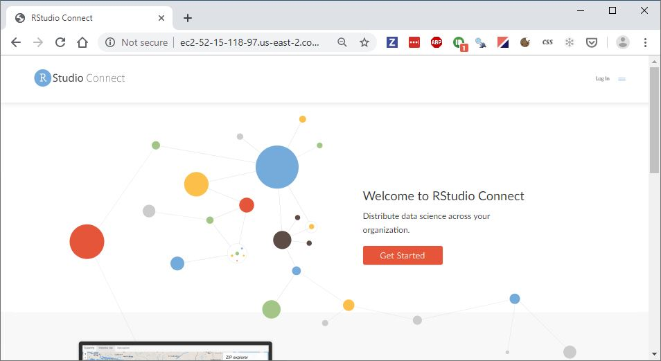

In the top, right hand corner you can find the “log in” button. Click
this.

You will be prompted for a user name and password. Use the information
you collected in Step 3.

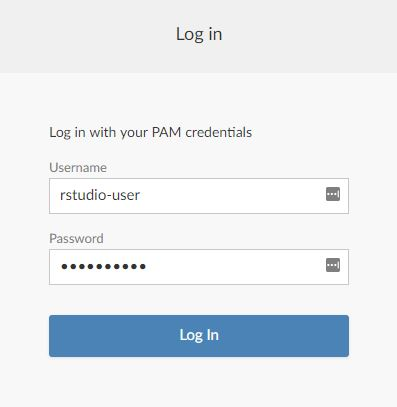

Complete the log in process.

## Step 7: Connect to RStudio Connect

To publish shiny apps, R markdown report and `plumber` APIs to RStudio
Connect, you must first connect your RStudio Server Pro instance to your
user acccount on RStudio Connect.

To do this:

  - In RStudio Server Pro, sse the menu item `Tools --> Global Options
    --> Publishing`

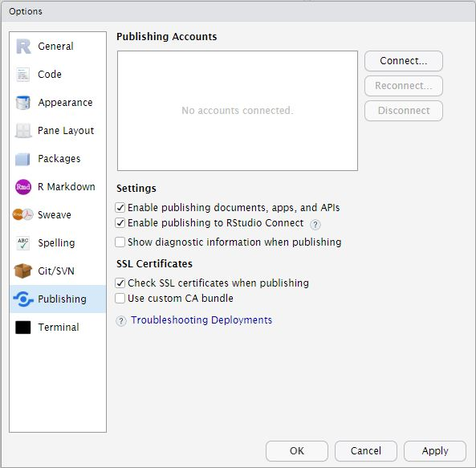

  - Click the `Connect...` button

  - Select “RStudio Connect”

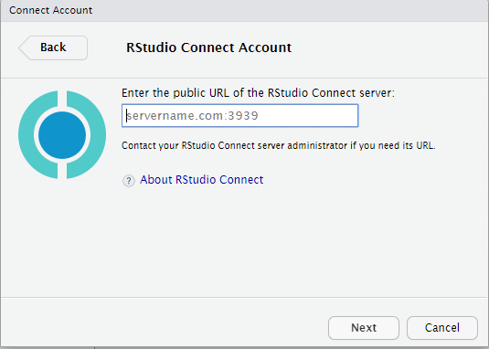

  - Enter the URL that you noted down in step 3. Then click "next\`

  - This will start a process of validating your account agains RStudio
    Connect.

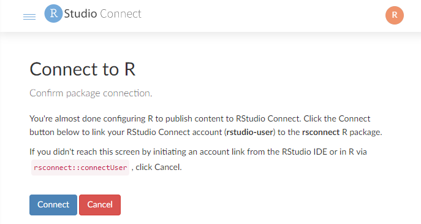

  - Click “Connect”. This will prompt you for credentials.

  - Use the same credentials you noted in Step 3

  - If you entered the correct credentials, you will land back in
    RStudio Server Pro, where the window should say “Account verified”

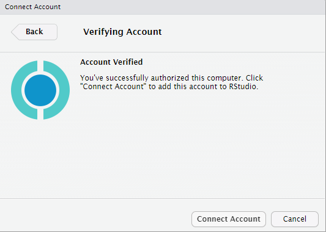

  - Click “Connect account”. This will take you back to the RStudio
    Server Pro options screen, where your connected account should show
    up in the list of “Publishing account”.

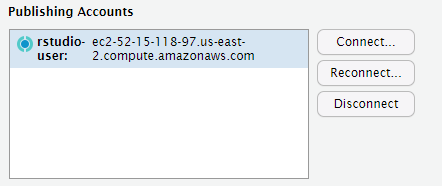

  - Click “OK”

## Step 8: Publish a shiny app

To test that everything worked, create and publish a Shiny app to
Connect:

  - In the RStudio Server Pro menu, click `File --> New file --> Shiny
    Web App...`

  - Give the file a name, e.g. `test`

  - Run the shiny app, to prove to yourself it works locally

  - Click the publish button 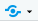
    (next to the “Run Shiny App” button)

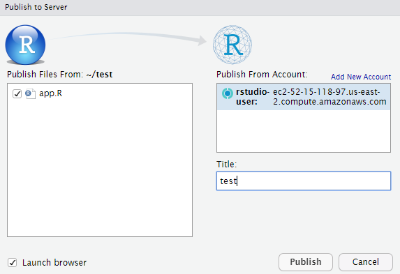

  - Give the app a title and press Publish

  - This starts the upload of a “bundle” with your app code and package
    dependencies.

  - Upon successful completion, your newly deployed app will open in
    RStudio Connect
